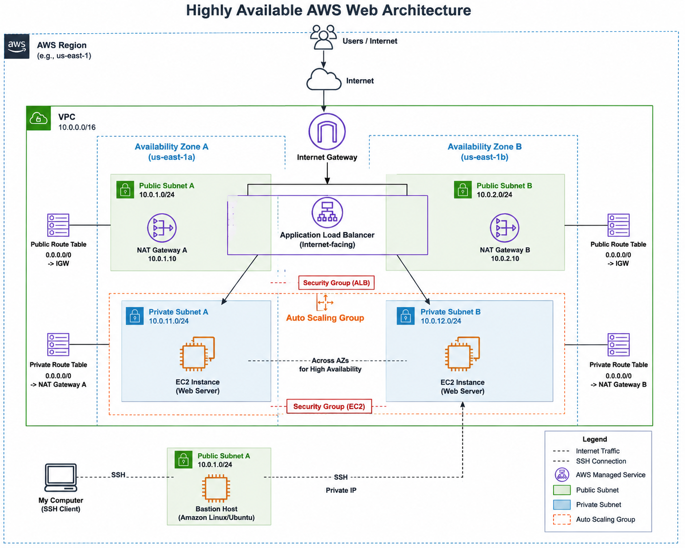
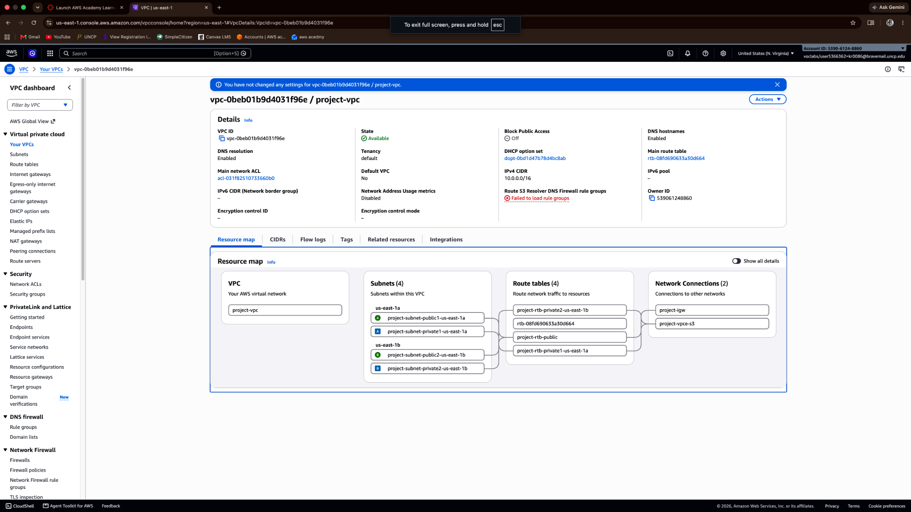
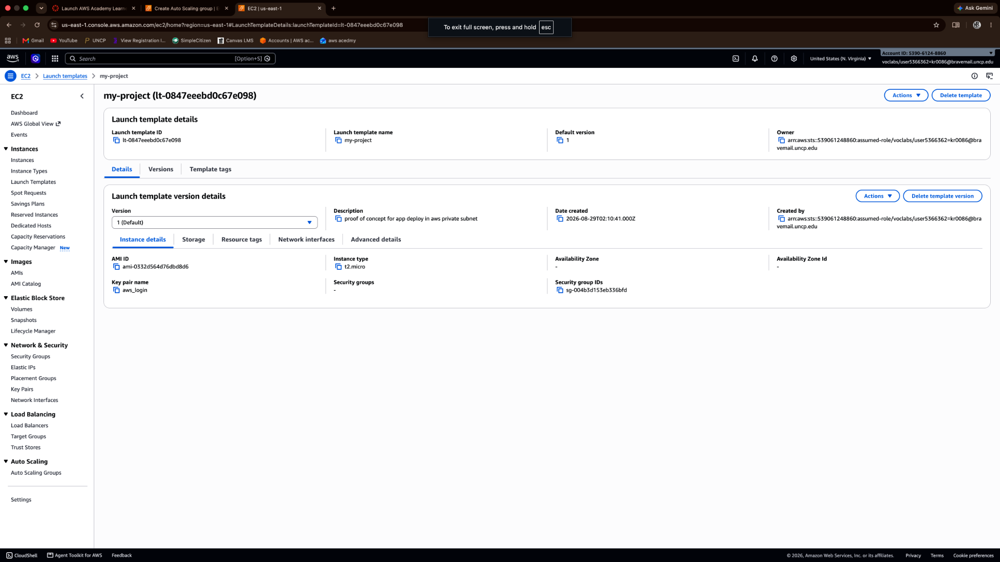
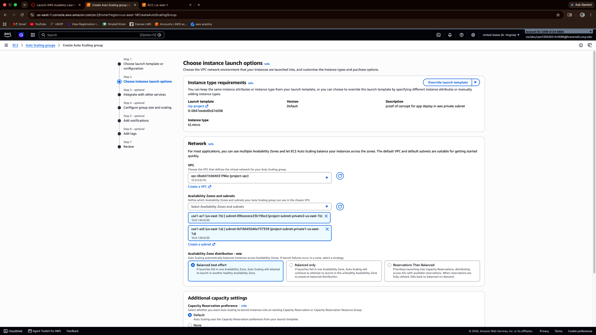
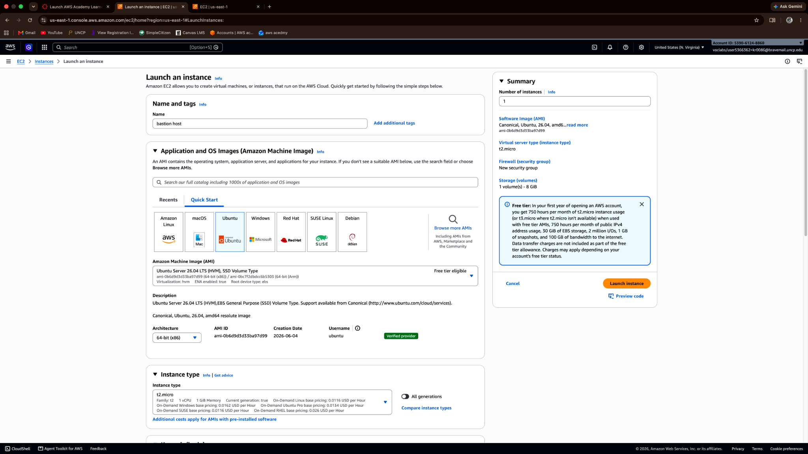
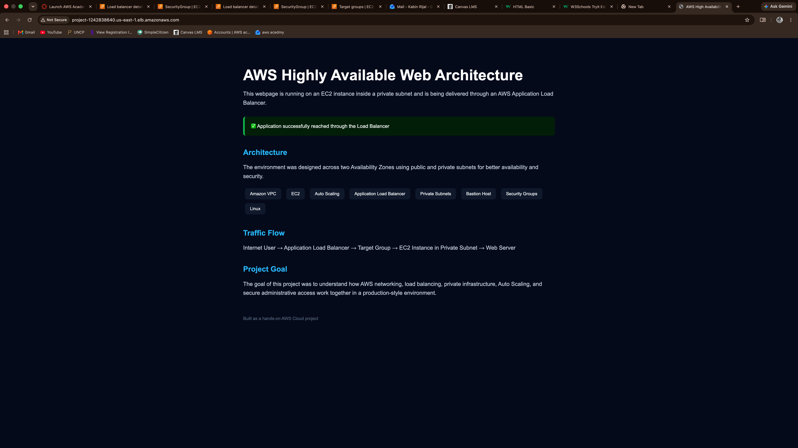

# Highly Available AWS VPC Architecture

## About the Project

This project was built to help me understand how a production-style AWS network works instead of only launching a single EC2 instance and exposing it directly to the internet.

I created a custom VPC across two Availability Zones with public and private subnets. The application servers run inside the private subnets and receive traffic through an internet-facing Application Load Balancer.

I also used an Auto Scaling Group with a Launch Template to manage the EC2 instances and created a bastion host so I could securely reach the private instances for administration and troubleshooting.

## Architecture

The architecture includes:

- Custom AWS VPC
- Two Availability Zones
- Two public subnets
- Two private subnets
- Internet Gateway
- Route tables
- Application Load Balancer
- Target Group
- EC2 instances
- Launch Template
- Auto Scaling Group
- Bastion Host
- Security Groups

### Traffic Flow

Internet User
→ Application Load Balancer
→ Target Group
→ EC2 instances in private subnets
→ Web application

Administrative access:

My Computer
→ Bastion Host
→ Private EC2 Instance

## What I Built

### 1. VPC and Network Design

I created a custom VPC using the CIDR range `10.0.0.0/16`.

The network spans two Availability Zones and contains public and private subnets. The purpose of using multiple Availability Zones was to avoid designing the application around a single AZ.

### 2. Launch Template and Auto Scaling

I created an EC2 Launch Template that defines how the application instances should be launched.

I then created an Auto Scaling Group across the two private subnets.

The group was configured with:

- Minimum capacity: 1
- Desired capacity: 2
- Maximum capacity: 4

This helped me understand the difference between manually launching EC2 instances and defining a reusable configuration that AWS can use to create and maintain instances.

### 3. Bastion Host

Because the application EC2 instances are inside private subnets, I created a bastion host inside a public subnet.

This gives me a controlled path for SSH access:

My Computer → Bastion Host → Private EC2

### 4. Application Load Balancer

I created an internet-facing Application Load Balancer across two Availability Zones.

The ALB listens for HTTP traffic on port 80 and forwards requests to the target group containing the application servers.

This allows the EC2 application servers to remain private while the application can still be reached from the internet.

## Troubleshooting and What I Learned

The most useful part of this project was troubleshooting the things that did not work the first time.

### Bastion Host Had No Public IP

I initially launched my bastion host inside a public subnet but noticed that it did not receive a public IPv4 address.

I originally assumed that putting an EC2 instance inside a public subnet automatically meant the instance would have a public IP.

After checking the subnet settings, I found that automatic public IPv4 assignment was disabled.

This helped me understand that **a public subnet and a public IP are two different concepts**.

### SSH Permission Denied

After connecting to the bastion host, I tried connecting to one of my private EC2 instances and received:

`Permission denied (publickey)`

At first I checked my SSH key permissions, but the key was not the actual problem.

My bastion host was running Ubuntu while the private instance created by my Launch Template was running Amazon Linux 2023.

I was trying to connect using:

`ubuntu@private-ip`

Amazon Linux uses:

`ec2-user@private-ip`

After changing the username, the SSH connection worked.

### Application Load Balancer Timeout

When I first tried opening the Application Load Balancer DNS address, the connection timed out.

I went back through the traffic path and checked the networking and security configuration until the ALB was able to successfully forward HTTP traffic to the application server.

Seeing my HTML page load through the ALB helped me understand the complete request path:

Browser → ALB → Target Group → Private EC2 → Web Server

## What I Learned

This project helped me get hands-on experience with:

- VPC networking
- Public vs private subnets
- Availability Zones
- Route tables
- Internet Gateways
- Security Groups
- EC2
- SSH
- Bastion hosts
- Launch Templates
- Auto Scaling Groups
- Application Load Balancers
- Target Groups
- Linux
- Troubleshooting cloud networking

More importantly, I started understanding how these AWS services work together instead of learning each service separately.

## Future Improvements

Some improvements I would like to make as I continue learning:

- Add HTTPS using AWS Certificate Manager
- Use Route 53 with a custom domain
- Improve monitoring with CloudWatch
- Automate infrastructure deployment using Terraform

  ## Project Screenshots

### VPC Resource Map

### Launch Template

### Auto Scaling Group

### Bastion Host Access

### Application Load Balancer

### Working Application

- Build a CI/CD pipeline for application deployment
- Explore AWS Systems Manager Session Manager as an alternative to a traditional bastion host
